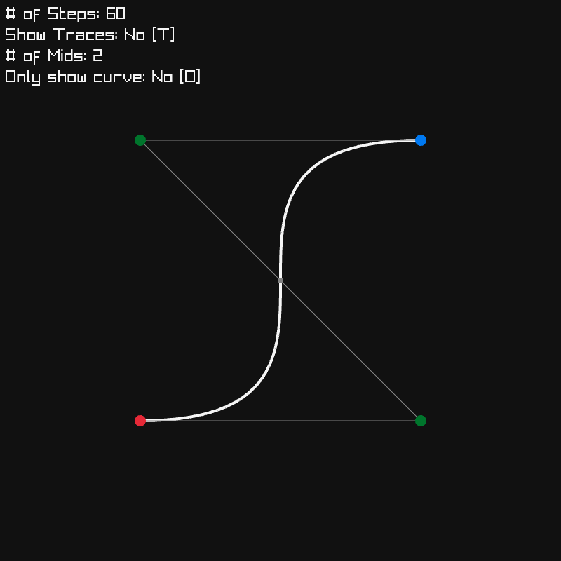

# Bézier Experiments

A simple experiment with making Bézier curves, nothing special, and
certainly not the most efficient.



## Controls

| Control              | Action                                                |
| -------------------- | ----------------------------------------------------- |
| Left click           | Move start point                                      |
| Right click          | Move end point                                        |
| Middle click         | Drag middle point that is hovered over                |
| Scroll Up/Down       | Increase/Decrease count of steps when drawing curves  |
| Shift Scroll Up/Down | Increase/Decrease count of mid points (min 1, max 10) |
| 1, 2, 3, ..., 0      | Put a midpoint at your cursor position                |

## Building

[RayLib](https://raylib.com) will need to be installed to build this project.

```sh
make
# or just
cc -o main main.c -lraylib
```
